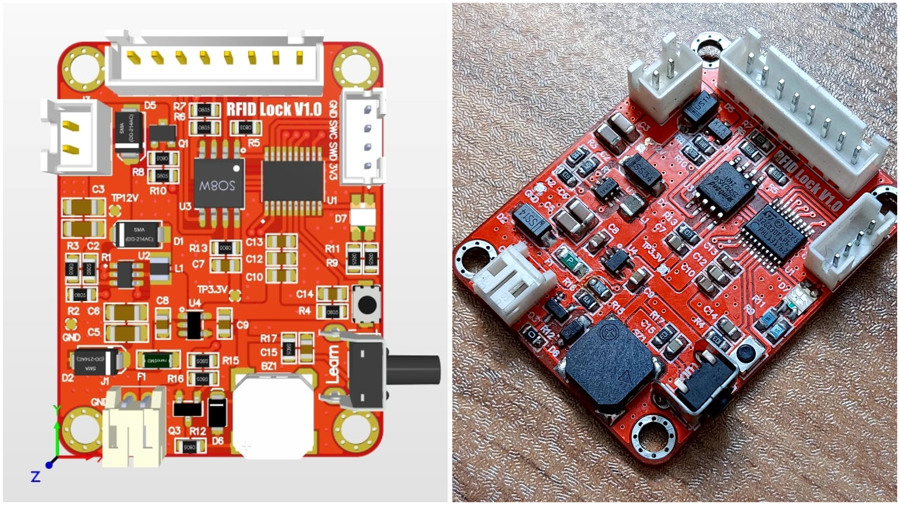

# RFID Lock System with STM32G030F6P6

This project is an embedded access control system using RFID tags, built around the STM32G030F6P6 microcontroller. It uses the RC522 RFID reader module to read RFID cards and controls a 12V solenoid lock for physical access. Authorized tag information is stored in external flash memory (W25Q32) for non-volatile access control.

## 💡 Features

- **RFID Reader (RC522)**: Reads MIFARE-compatible RFID cards/tags.
- **Microcontroller (STM32G030F6P6)**: ARM Cortex-M0+ based low-power MCU.
- **External Flash Storage (W25Q32)**: Stores authorized UID tags.
- **12V Solenoid Lock**: Controls physical access (locked/unlocked state).

### 📋 Additional Details:

| Component               | Specification                        |
|-------------------------|--------------------------------------|
| **Microcontroller**     | STM32G030F6P6                        |
| **Operating Frequency** | 64MHz                                |
| **Programming Language**| Embedded C                           |
| **IDE**                 | stm32cubeide                         |
| **PCB Design Software** | Altium Designer                      |
| **Version Control**     | Git, GitHub                          |
| **RFID Module**         | RC522                                |
| **Output**              | MOSFET-SSM3K333R                     |
| **Memory**              | W25Q32                               |
| **12V Regulator**       | MT3608                               |
| **3.3V Regulator**      | TLV74333                             |

## ⚙️ How It Works
The system operates as a standalone RFID-based access control unit with basic programming features via a single button and onboard indicators (LEDs and buzzer). Here's an overview of its behavior:

### Normal Mode (Access Control)

✅ __When an RFID tag is scanned:__

If the tag's UID matches an authorized entry stored in the external flash memory, the system:

Activates the solenoid lock for 1 second

the green LED blinking

Emits 4 short beeps from the buzzer

❌ __If the tag's UID is not recognized:__

The red LED blinking

The buzzer emits a continuous tone indicator access denied

### Add New Tag (Learning Mode)

Press and hold the LEARN button, then present an RFID tag to the reader.

The UID of the tag is stored in external flash memory.

From now on, this tag will be recognized as an authorized tag and unlock the solenoid when scanned.

### Clear All Tags

Press and hold the LEARN button for 3 seconds.

The system responds by:

Turning on the yellow LED

Erasing all stored UIDs from the memory

Emitting 3 long beeps from the buzzer

Entering a brief state with a flashing red LED to indicate the memory has been cleared